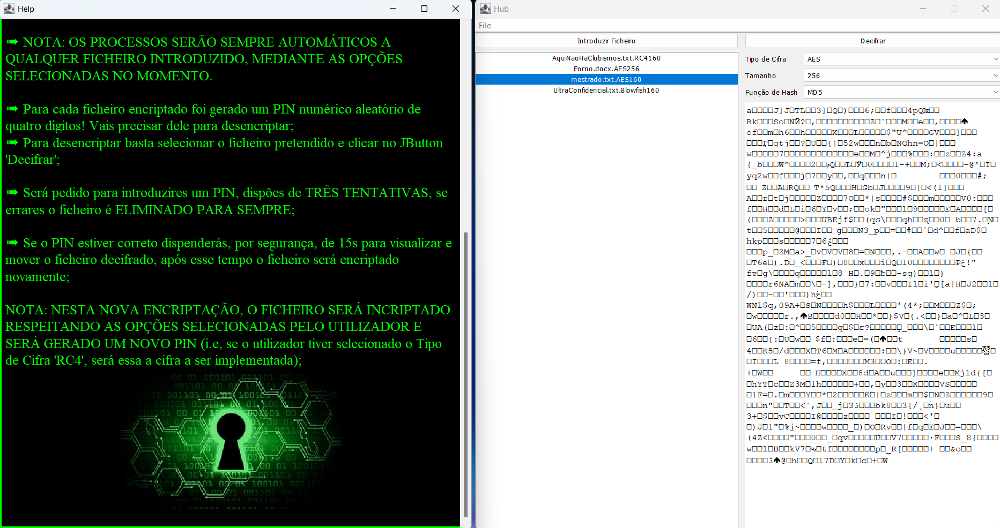
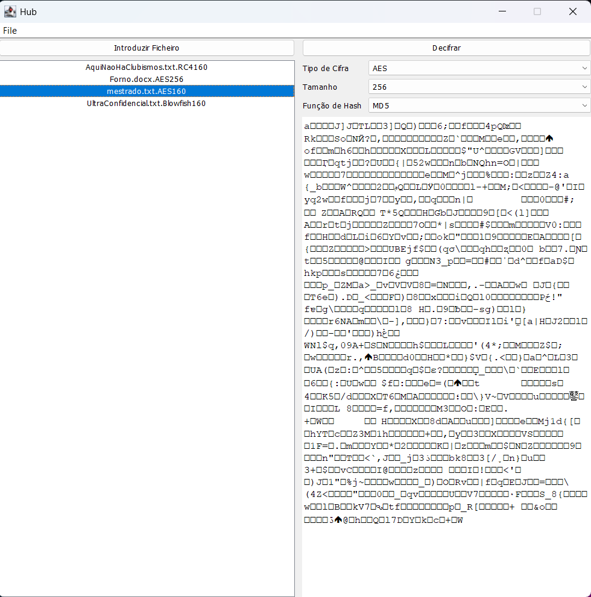
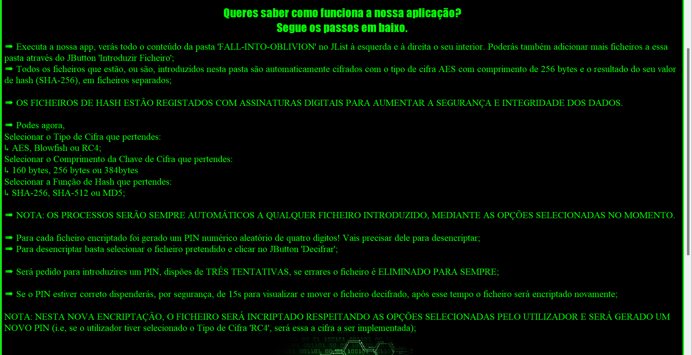

# 
# Projeto - FALL-INTO-OBLIVION
<table>
<tr>
<td>
  O objetivo principal deste projeto é construir uma aplicação que simule a funcionalidade do
Recycle Bin dos sistemas operativos modernos, mas de uma forma alternativa pouco convencional.
</td>
</tr>
</table>

## Repositório GitHub
Após a entrega deste projeto ficará publico :  https://github.com/DidiTuga/fall_into_oblivio

## Aplicação

### Página Principal
Nesta página poderás interagir com todas as funcionalidades oferecidas pela nossa aplicação.

### Página de Ajuda
Aqui encontras, passo a passo, tudo o que precisas para trabalhar no nosso software.

### Como usar executar App?

- O executável encontra-se na pasta `dist` com o nome `FallIntoOblivion.jar`
- Executa a app
- Desfruta e Diverte-te

## Documentação

- [Java Swing](https://docs.oracle.com/javase%2F7%2Fdocs%2Fapi%2F%2F/javax/swing/package-summary.html)
- [Java AES Encryption](https://www.baeldung.com/java-aes-encryption-decryption)

## Team

|  |  ||
---|--------------------------------------------------|------------------------------------------------------------------------------------------------------------|---|---
[Diogo Santos](https://github.com/DidiTuga)| [Luís Sá](https://github.com/luis-sa-ubi-2000)   | [Luís Santos](https://github.com/lsantos92)                                                                |[Tiago Barreiros](https://github.com/tiago-barreiros)|[Xavier Tacanho](https://github.com/XavierTacanho)

# Orientação
## [Pedro Inácio](https://www.di.ubi.pt/~inacio/)

## Objetivos
### Funcionalidades Minimas

- [x]  Permitir cifrar ficheiros, guardando o resultado numa pasta chamada FALL-INTO-OBLIVION; (explorar diferentes
  tipos de cifra);
- [x]  Calcular o valor de hash do ficheiro, guardando também o resultado junto com o criptograma (em ficheiros separados) (explorar diferentes valores de hash)
- [x]  Gerar automaticamente um PIN, e usá-lo como chave para cifrar cada ficheiro;
- [x]  Calcular o MAC dos criptogramas;
- [x]  Permitir decifrar o ficheiro por via da adivinhação do PIN. Só devem ser permitidas até 3 tentativas;
- [x]  Verificar a integridade do ficheiro no caso do PIN ter sido adivinhado;
- [x]  Correr em modo modo Client Line Interface (CLI) ou em modo gráfico.

### Funcionalidades adicionais

- [x]  Substituir os MACs por assinaturas digitais (o programa deve então também permitir
  gerar as chaves pública e privadas);
- [x]  Permitir que o utilizador escolha a cifra a utilizar e o comprimento da chave de cifra;
- [x]  Permitir que o utilizador escolha a função de hash a usar;
- [x]  Ter um helpPage completo e intuitivo.
## *Segurança Informática* @[Universidade da Beira Interior](https://www.ubi.pt/).